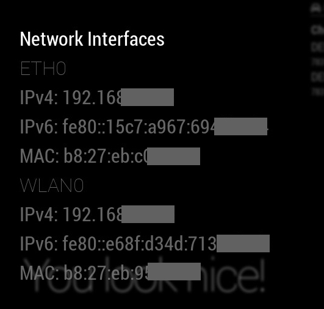

# MMM-ip [](https://raw.githubusercontent.com/fewieden/MMM-ip/master/LICENSE)  [](https://codeclimate.com/github/fewieden/MMM-ip) [](https://snyk.io/test/github/fewieden/mmm-ip)

IPv4/IPv6 Network Address Module for MagicMirror<sup>2</sup>

## Example

 

## Dependencies

* An installation of [MagicMirror<sup>2</sup>](https://github.com/MichMich/MagicMirror)
* OPTIONAL: [Voice Control](https://github.com/fewieden/MMM-voice) and [MMM-Modal](https://github.com/fewieden/MMM-Modal)

## Installation

* Clone this repo into `~/MagicMirror/modules` directory.
* Configure your `~/MagicMirror/config/config.js`:

```js
{
    module: 'MMM-ip',
    position: 'bottom_right', // Remove the position if you want to run the module in voice only mode
    config: {
        // all your config options, which are different than their default values
    }
}
```

## Config Options

| **Option** | **Default** | **Description** |
| --- | --- | --- |
| `fontSize` | `9` | Font size in pixels. |
| `dimmed` | `true` | Boolean for discrete visibility |
| `families` | `['IPv4', 'IPv6']` | Array of network address families to display. Possible values in the array are: `'IPv4'` and `'IPv6'`. |
| `types` | `['eth0', 'wlan0']` | Array of network interface types to display. Check the types of your network cards in the logs. They get logged on MagicMirror start. |
| `updateInterval` | `300000` (5 mins) | How often should the network interface list be updated in milliseconds? |

## OPTIONAL: Voice Control and Modal

This module supports voice control by [MMM-voice](https://github.com/fewieden/MMM-voice) and [MMM-Modal](https://github.com/fewieden/MMM-Modal).
In order to use this feature, it's required to install the voice and modal modules. There are no extra config options for voice control and modals needed.

### Mode

The voice control mode for this module is `NETWORK`

### List of all Voice Commands

* OPEN HELP -> Shows the information from the readme here with mode and all commands.
* CLOSE HELP -> Hides the help information.
* SHOW INTERFACES -> Shows network interfaces based on config options with mac addresses.
* HIDE INTERFACES -> Hide network interfaces.

## Developer

* `npm run lint` - Lints JS and CSS files.
* `npm run docs` - Generates documentation.
